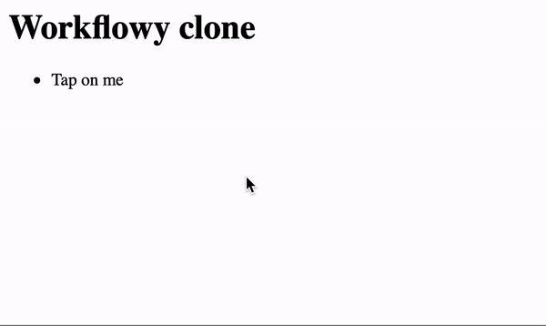

# hyperflowy

[Workflowy](https://workflowy.com/) clone using [_hyperscript](https://hyperscript.org). It supports navigation keys, creating tasks with `Enter` and moving with `Tab`. **This repo is intended for demo purposes**.

[Demo website](https://hyperflowy.ustits.dev)

